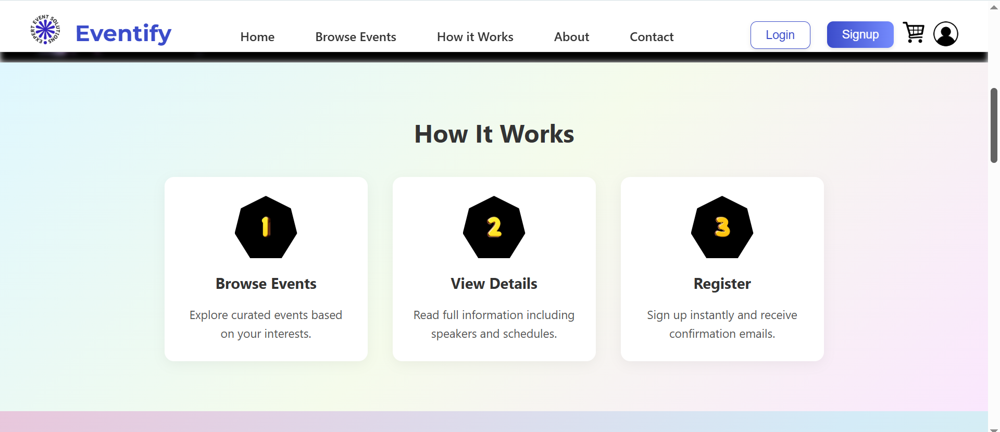
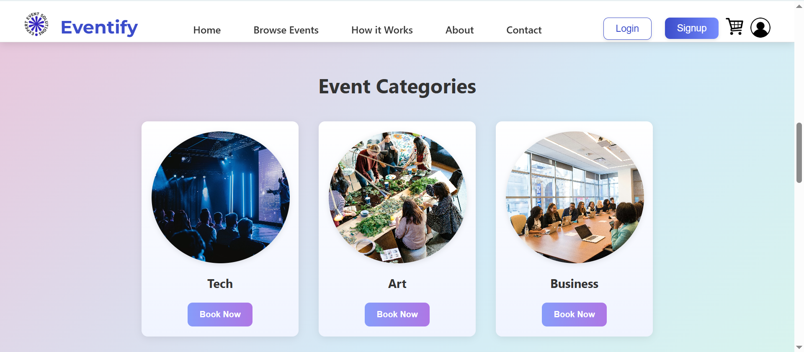

# Eventify – Event Booking Website

Eventify is a modern and responsive web application that allows users to browse, view, and register for various events. It is built using **React.js** and provides a clean, user-friendly interface suitable for event organizers and attendees alike. But this is only the frontend for just user intraction but it will be updated with backend soon.

---

## Objective

The goal of this project is to create a professional event booking platform where:
- Visitors can explore upcoming events
- View event details and categories
- Register for events using a simple form
- See confirmation of their booking

---

## Technologies Used

- React.js (Frontend)
- React Router
- JavaScript (ES6+)
- HTML5 & CSS3
- Bootstrap 5 / Tailwind CSS (for styling)
- Git & GitHub (for version control and hosting)
- GitHub Pages (for deployment)

---

## Screenshots


*Homepage with Header*


*Describe that how you book and event*


*Browse different events*

---

## Folder Structure
Eventify/
│
├── public/
│ └── index.html
│
├── src/
│ ├── components/
│ │ ├── Navbar.jsx
│ │ ├── EventCard.jsx
│ │ └── ...
│ ├── pages/
│ │ ├── HomePage.jsx
│ │ ├── EventDetails.jsx
│ │ └── RegisterPage.jsx
│ ├── App.js
│ └── index.js
│
├── package.json
└── README.md

---

##  How to Run the Project Locally

1. Clone the repository:
   ```bash
   git clone https://github.com/ZoyaKhalid/Eventify.git
   cd Eventify
2. Install dependencies:
   ```bash
   npm install
3. Run the app:
   ```bash
   npm run
